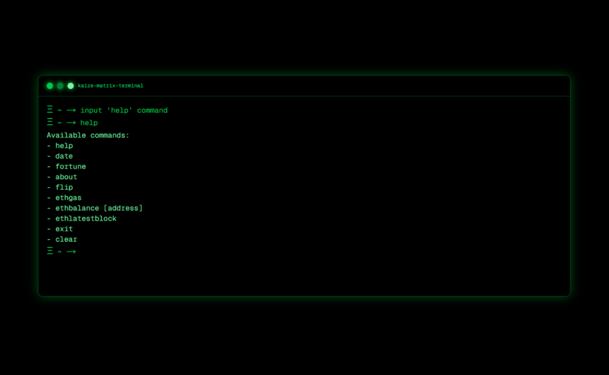

# terminal-in-the-green-matrix-style


## Getting Started

The project uses [Next.js](https://nextjs.org/) and [shadcn](https://ui.shadcn.com/docs/installation)

First, run the development server:

```bash
npm i
# and
npm run dev
# or
yarn dev
# or
pnpm dev
# or
bun dev
```


Open [http://localhost:3000](http://localhost:3000) with your browser to see the result.

You can start editing the page by modifying `app/page.tsx`

## Additional

This project was created as a template for building your own terminal in the browser, you can easily customize it to your needs
